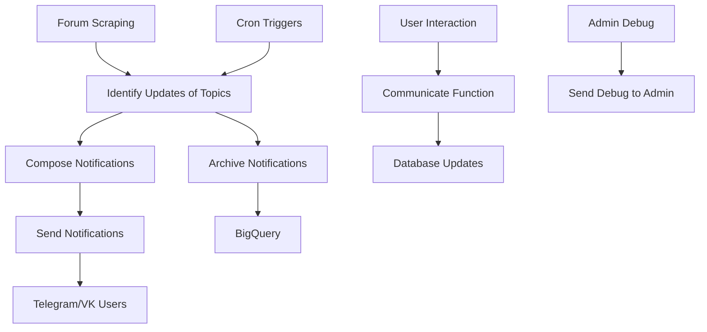

# LizaAlert Searcher Bot – Analysis and Recommendations for AI Agents

## Project Overview

The LizaAlert Searcher Bot is a volunteer-driven notification system that helps coordinate search‑and‑rescue operations across Russia. It monitors the LizaAlert forum (phpbb), detects new searches and updates, and sends personalized notifications to Telegram/VK users based on their region and preferences.

**Technology Stack:**
- **Language:** Python 3.12+
- **Runtime:** Yandex Cloud Functions (originally GCP)
- **Message Broker:** Yandex Pub/Sub (formerly Google Pub/Sub)
- **Storage:** PostgreSQL (Cloud SQL), Yandex Object Storage, BigQuery
- **UI:** Telegram Bot (+ VK Bot), companion web‑app [LA Map](https://github.com/cherrytea-dev/la_map)
- **CI/CD:** GitHub Actions
- **Infrastructure as Code:** Terraform (Yandex Cloud)
- **Tooling:** UV (package manager), Ruff (linting), mypy (type checking), pytest

## Architecture

The system is built as a pipeline of serverless functions triggered by Pub/Sub messages, timers (cron), and HTTP requests. Each function is a separate Python module under `src/` with its own `requirements.txt`. Shared code lives in `src/_dependencies`.

### High‑Level Data Flow

**Detailed Function Roles:**

1. **`check_topics_by_upd_time`** – Cron‑triggered; fetches list of recently‑updated forum folders, publishes folder IDs to Pub/Sub.
2. **`identify_updates_of_topics`** – Pub/Sub‑triggered; parses folders, detects new/updated searches, writes changes to `change_log` table.
3. **`compose_notifications`** – Pub/Sub‑triggered; for each `change_log` entry, builds personalized messages for relevant users, stores them in `notifications` table.
4. **`send_notifications`** – Pub/Sub‑triggered; delivers stored notifications via Telegram/VK API.
5. **`communicate`** – HTTP‑triggered (Telegram webhook); handles user commands, settings, and region selection.
6. **`title_recognize`** – HTTP‑triggered; NLP service that extracts person, location, age, and status from search titles (uses Natasha library).
7. **`connect_to_forum`** – Pub/Sub‑triggered; links Telegram users to forum profiles.
8. **`archive_notifications`** – Moves sent notifications to cold storage (Object Storage) and BigQuery.
9. **`check_first_posts_for_changes`** – Monitors RSS feed for first‑post updates.
10. **`user_provide_info`** – API endpoint that returns active searches for the web‑app.
11. **`vk_bot`** – Separate VK‑based bot (polling‑based).
12. **`send_debug_to_admin`** – Centralized logging/alerting via Pub/Sub.

### Shared Dependencies (`src/_dependencies`)

- **`commons`** – App config, logging setup, SQLAlchemy connection pool.
- **`pubsub`** – Wrappers for Yandex Pub/Sub; defines topic enum.
- **`users_management`** – User‑state operations.
- **`topic_management`** – Forum‑topic operations.
- **`telegram_api_wrapper`** – Telegram Bot API wrapper with rate‑limiting.
- **`vk_api`** – VK API wrapper.
- **`yandex_tools`** – Yandex‑specific helpers (logging, API calls).
- **`lock_manager`** – Prevents parallel execution of the same function.
- **`recognition_schema`** – Pydantic models for title‑recognition results.

## Dependencies

All dependencies are managed via `pyproject.toml` with UV lock‑file. Key packages:

- `python‑telegram‑bot[rate‑limiter, job‑queue]==21.*`
- `SQLAlchemy==1.4.54`
- `psycopg2‑binary==2.9.5`
- `beautifulsoup4==4.9.3` (from 2020 – could be updated)
- `pydantic‑settings==2.*`
- `requests>=2.32.4`, `httpx==0.27.*`
- `natasha==1.4.0` (for Russian NLP)
- `vk‑api>=11.10.0`

**Observations:**
- Most dependencies are reasonably up‑to‑date.
- `beautifulsoup4` is quite old (4.9.3); consider upgrading to 4.12.x for security and performance.
- `SQLAlchemy 1.4.54` is not the latest (2.x available); migration would be a significant effort but could bring performance and typing benefits.
- Python 3.12+ is required; the code uses modern typing features.

## Code Quality

**Strengths:**
- Consistent use of type hints (mypy configured with strict settings).
- Structured logging with cloud‑logging integration.
- Configuration via Pydantic settings (environment variables).
- SQLAlchemy connection pooling with sensible defaults.
- Comprehensive test suite (unit tests for each function, mocked external services).
- Code formatting enforced by Ruff (line‑length 120, single quotes).

## Testing

The project includes a robust test suite under `tests/`. Highlights:

- need to activate python virtual environment before run tests.
- **`conftest.py`** patches external dependencies (HTTP, Pub/Sub, config).
- **Factory‑boy style fixtures** (`tests/factories/`) generate database models.
- **Integration‑style tests** that run against a local PostgreSQL container (`make ci‑test`).
- **Parallel test execution** (`pytest -n 4`).
- **Type‑checking** (`make mypy`) and linting (`make lint`) integrated into CI.

## References

- [README.md](README.md)
- [CONTRIBUTING.md](CONTRIBUTING.md)
- [Architecture Diagram](doc/cloud_functions_architecture.html)
- [PyProject.toml](pyproject.toml)
- [Terraform Configuration](terraform/)

---
*Document generated by AI Architect on 2026‑04‑19. Intended for use by AI agents contributing to the LizaAlert Searcher Bot project.*