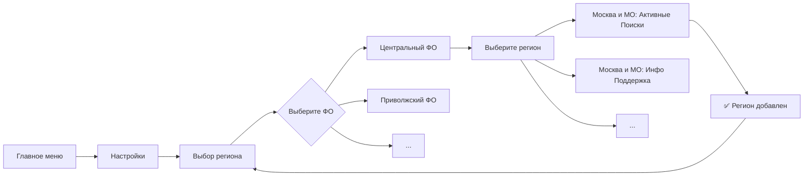
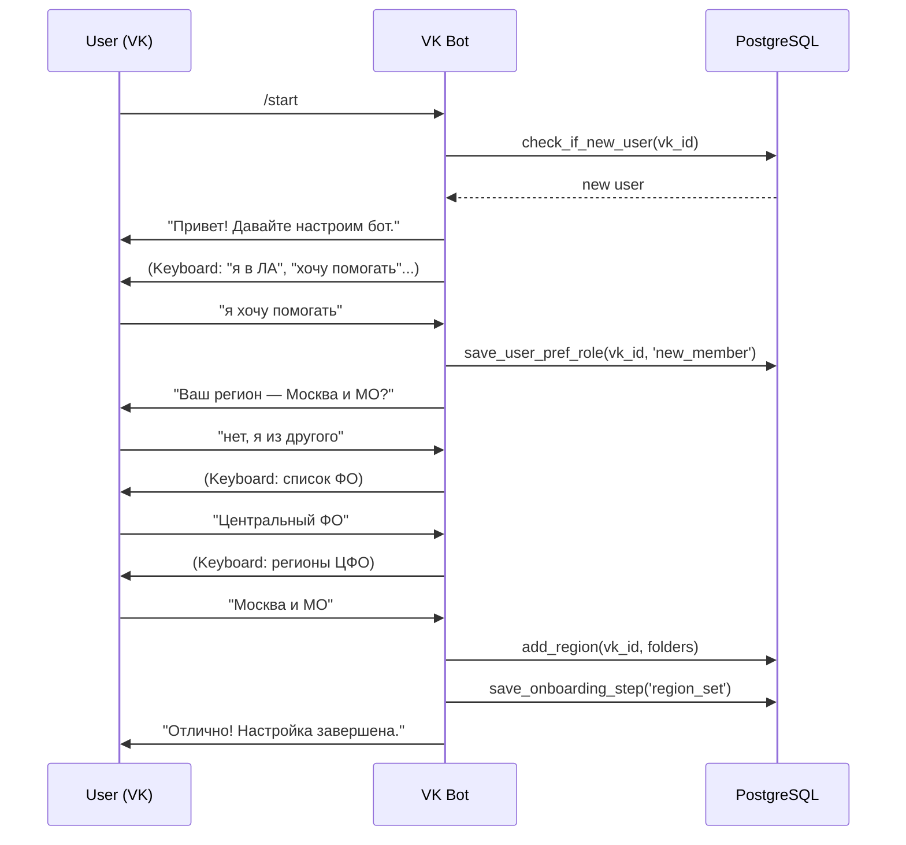
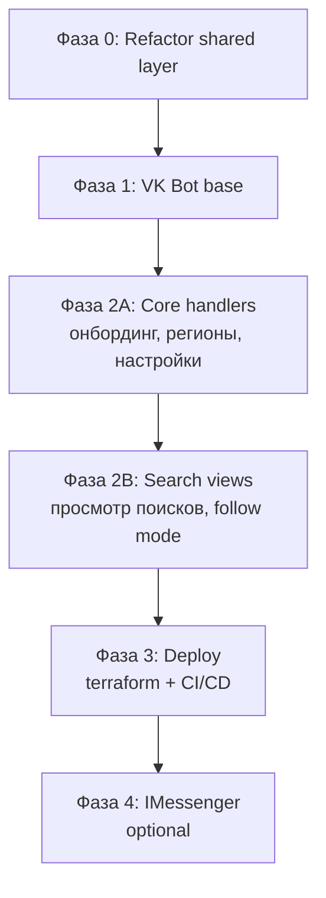

# Архитектура: Дублирование функциональности communicate в VK Bot

## 1. Текущее состояние

### 1.1 Telegram Bot (`src/communicate/`)

```
communicate/main.py
  └── process_update()
       ├── _get_basic_update_parameters()  ← парсинг Update → UpdateBasicParams
       ├── _run_handlers()
       │    └── COMMON_HANDLERS[]          ← цепочка handler'ов
       │         ├── @state_handler         ← проверка UserInputState
       │         ├── @button_handler        ← проверка got_message по списку
       │         └── @callback_handler      ← проверка InlineButtonCallbackData
       └── _process_handler_result()
            ├── _reply_to_user()           ← отправка ответа (InlineKeyboardMarkup / ReplyKeyboardMarkup)
            └── db().set_user_input_state() ← сохранение стейта
```

**Ключевая проблема:** Бизнес-логика (работа с БД, формирование данных) **тесно переплетена** с Telegram-специфичными UI-компонентами (`InlineKeyboardMarkup`, `ReplyKeyboardMarkup`, `CallbackQuery`, `InlineKeyboardButton`, `WebAppInfo`).

### 1.2 VK Bot (`src/vk_bot/`)

```
vk_bot/main.py
  └── main_raw()
       └── UpdateEvent → process_incoming_message()
            ├── Парсинг invite-текста
            └── Вызов vk_api_client.send()
```

**Ограничения:**
- Только привязка аккаунта (Telegram → VK)
- Нет регистрации, настроек, просмотра поисков
- Работает через polling (VkLongPoll)
- [`vk_api_client.py`](src/_dependencies/vk_api_client.py) — минимальный HTTP-клиент (send, get_user_by_login)

### 1.3 Различия VK vs Telegram API

| Характеристика        | Telegram                                                              | VK                                                                |
| --------------------- | --------------------------------------------------------------------- | ----------------------------------------------------------------- |
| **Inline-кнопки**     | `InlineKeyboardMarkup` — callback_data + url                          | `inline_keyboard` — только url-кнопки. Callback-действий нет      |
| **Обычные кнопки**    | `ReplyKeyboardMarkup` — resizeable, request_location, request_contact | `keyboard` — только текст, можно раскрасить. Без request_location |
| **Callback-механизм** | `CallbackQuery` — редактирование сообщения, ответ                     | VK Callback API → событие message_event. Можно editMessage        |
| **Редактирование**    | `editMessageText`, `editMessageReplyMarkup`                           | `messages.edit` — только текст, клавиатуру отдельно               |
| **Геолокация**        | `request_location` в ReplyKeyboard                                    | Нет built-in. Только ручной ввод координат                        |
| **WebApp**            | `WebAppInfo` — Telegram Web Apps                                      | Нет аналога                                                       |
| **Стейт-машина**      | ConversationHandler (не используется) / самописная UserInputState     | Нет встроенной — только самописная                                |
| **Форматирование**    | HTML / MarkdownV2                                                     | Свой формат: **bold**, _italic_, [link\|text], <br>               |
| **Webhook**           | HTTP POST (Yandex Cloud Functions)                                    | Callback API (HTTP POST) или LongPoll                             |

## 2. Предлагаемая архитектура

```
┌──────────────────────────────────────────────────────────────────────┐
│                      Shared Layer (_dependencies/)                    │
│                                                                      │
│  ┌─────────────────────┐  ┌──────────────────┐  ┌────────────────┐  │
│  │ user_settings_      │  │ state_machine.py  │  │ message_        │  │
│  │ service.py          │  │ (UserInputState + │  │ formatter.py   │  │
│  │ (регионы, подписки, │  │  DB-based state)  │  │ (текстовые     │  │
│  │  настройки, роли)   │  │                   │  │  шаблоны)      │  │
│  └─────────────────────┘  └──────────────────┘  └────────────────┘  │
│                                                                      │
│  ┌─────────────────────┐  ┌──────────────────┐  ┌────────────────┐  │
│  │ users_management.py │  │ commons.py        │  │ db_client.py   │  │
│  │ (сущ.)              │  │ (AppConfig,       │  │ (сущ.)         │  │
│  │                     │  │  enums)           │  │                │  │
│  └─────────────────────┘  └──────────────────┘  └────────────────┘  │
└──────────────────────────────────────────────────────────────────────┘
         ▲                            ▲
         │                            │
         ▼                            ▼
┌──────────────────────┐  ┌──────────────────────────┐
│   communicate (TG)    │  │   vk_bot_new (VK)        │
│                       │  │                          │
│  main.py              │  │  main.py                 │
│  handlers/            │  │  handlers/               │
│  buttons.py (TG)      │  │  keyboards.py (VK JSON)  │
│  message_sending.py   │  │  message_sending.py      │
│  regions.py (TG)      │  │  regions.py (VK)         │
│  decorators.py        │  │  dispatcher.py           │
│  common.py            │  │  database.py             │
│  database.py          │  │                          │
└──────────────────────┘  └──────────────────────────┘
```

### 2.1 Shared Layer — новые модули

#### `src/_dependencies/user_settings_service.py`

**Назначение:** Единый API для работы с пользовательскими настройками, используемый обоими ботами.

**Методы:**
- `get_user_settings_summary(user_id) → UserSettingsSummary`
- `save_user_pref_role(user_id, role_desc) → str`
- `save_user_pref_topic_type(user_id, user_role)`
- `save_user_radius(user_id, radius)`
- `delete_user_saved_radius(user_id)`
- `check_saved_radius(user_id) → int | None`
- `save_user_coordinates(user_id, lat, lon)`
- `delete_user_coordinates(user_id)`
- `get_user_coordinates(user_id) → tuple[str,str] | None`
- `toggle_region_subscription(user_id, region_text) → bool`
- `get_user_region_list(user_id) → list[int]`
- `toggle_notification_preference(user_id, pref_name, enable: bool)`
- `get_notification_preferences(user_id) → list[str]`
- `save_age_preference(user_id, age_period)`
- `delete_age_preference(user_id, age_period)`
- `get_age_preferences(user_id) → list[AgePeriod]`
- `save_onboarding_step(user_id, step)`
- `get_onboarding_step(user_id) → tuple[int, str]`
- `register_new_user(user_id, username, timestamp)`
- `check_if_new_user(user_id) → bool`

**Все эти методы уже существуют** в [`communicate/_utils/database.py`](src/communicate/_utils/database.py) и [`_dependencies/users_management.py`](src/_dependencies/users_management.py). Задача: вынести их в shared слой, оставив в communicate тонкую обёртку.

#### `src/_dependencies/state_machine.py`

**Назначение:** Хранение и проверка состояния диалога с пользователем (аналог `ConversationHandler`, но DB-based).

```python
# Интерфейс
class DialogState(Enum):
    radius_input = 'radius_input'
    input_of_coords_man = 'input_of_coords_man'
    input_of_forum_username = 'input_of_forum_username'
    region_selection = 'region_selection'
    not_defined = 'not_defined'

def set_user_state(user_id: int, state: DialogState) -> None: ...
def get_user_state(user_id: int) -> DialogState | None: ...
def clear_user_state(user_id: int) -> None: ...
```

**Сейчас это дублируется:** [`communicate/_utils/database.py`](src/communicate/_utils/database.py) (get_user_input_state, set_user_input_state) и [`connect_to_forum/main.py`](src/connect_to_forum/main.py) (аналогичный TODO).

#### `src/_dependencies/message_formatter.py`

**Назначение:** Все текстовые шаблоны, которые не зависят от платформы. Вынести **тексты** из handler'ов в отдельные константы/функции.

**Пример:**
```python
# Было: текст живёт внутри handler'а
def handle_radius_value(...) -> HandlerResult:
    bot_message = f'Сохранили! ... {saved_radius} км ...'
    
# Стало: текст в shared модуле
def compose_radius_saved_message(saved_radius: int) -> str:
    return f'Сохранили! ... {saved_radius} км ...'
```

### 2.2 VK Bot — новые модули

#### `src/vk_bot/_utils/dispatcher.py`

**Назначение:** Роутер входящих сообщений VK. Аналог `main.py` из communicate + `COMMON_HANDLERS` цепочка.

```python
def dispatch_event(event: UpdateEvent) -> None:
    """Главный роутер VK-бота"""
    event_type = event.type  # message_new, message_event, message_edit...
    
    if event_type == 'message_new':
        handle_message(event.object.message)
    elif event_type == 'message_event':
        handle_callback(event.object)
```

**Детектор команд:**
```python
COMMANDS = {
    '/start': handle_start,
    '/settings': handle_settings,
    '/help': handle_help,
    '/view_searches': handle_view_searches,
}

HANDLER_CHAIN = [
    state_handlers.handle_radius_value,        # state-based
    state_handlers.handle_coords_manual_input, # state-based
    button_handlers.handle_start,              # button/command-based
    button_handlers.handle_settings,
    ...
    button_handlers.handle_unknown,            # fallback
]
```

#### `src/vk_bot/_utils/keyboards.py`

**Назначение:** Построитель VK-клавиатур (JSON-формат).

```python
class VKKeyboard:
    @staticmethod
    def one_column(buttons: list[str]) -> dict:
        """VK keyboard with buttons in one column"""
        return {
            'buttons': [[{'action': {'type': 'text', 'label': btn, 'payload': ''}}] for btn in buttons],
            'one_time': False,
        }
    
    @staticmethod
    def main_menu() -> dict: ...
    
    @staticmethod
    def inline_keyboard(buttons: list[dict]) -> dict:
        """For callback/url buttons (VK inline keyboard in message)"""
        ...
```

#### `src/vk_bot/_utils/message_sending.py`

**Назначение:** Обёртка над VK API для отправки сообщений, обработки ошибок, rate limiting.

```python
class VKMessageSender:
    def send_message(self, user_id: int, text: str, keyboard: dict | None = None) -> None: ...
    def edit_message(self, user_id: int, message_id: int, text: str) -> None: ...
    def send_callback_answer(self, user_id: int, event_id: str, text: str) -> None: ...
```

#### `src/vk_bot/_utils/database.py`

**Назначение:** DBClient для VK-бота. Наследует [`DBClientBase`](src/_dependencies/db_client.py) + использует shared `user_settings_service`.

```python
class DBClient(DBClientBase):
    def set_user_vk_id(self, telegram_user_id: int, vk_id: int) -> None: ...
    # Возможно, понадобится:
    def get_user_by_vk_id(self, vk_id: int) -> int | None: ...  # telegram_user_id
    def is_user_registered_in_vk(self, vk_id: int) -> bool: ...
```

### 2.3 Архитектура handlers для VK

Каждый handler — функция, возвращающая `VKHandlerResult`:

```python
@dataclass
class VKHandlerResult:
    text: str
    keyboard: dict | None = None
    new_state: DialogState | None = None
    edit_message_id: int | None = None  # если нужно отредактировать
```

Пример handler'а:

```python
def handle_radius_value(message: VKMessage, state: DialogState | None) -> VKHandlerResult | None:
    if state != DialogState.radius_input:
        return None
    
    number = _parse_radius(message.text)
    if not number:
        return VKHandlerResult(
            text='Не могу разобрать цифры. Давайте еще раз попробуем?',
            keyboard=VKKeyboard.one_column(['включить ограничение по расстоянию', ...]),
        )
    
    user_settings_service.save_user_radius(message.from_id, number)
    return VKHandlerResult(
        text=f'Сохранили! Теперь поиски, у которых расстояние до штаба превышает {number} км...',
        keyboard=VKKeyboard.one_column([...]),
        new_state=DialogState.not_defined,
    )
```

### 2.4 Регионы: VK vs Telegram

**Проблема:** В Telegram регионы выбираются через `InlineKeyboardMarkup` с буквами-фильтрами (см. [`regions.py`](src/communicate/_utils/regions.py) — `get_inline_keyboard_by_first_letter`).

**Решение для VK:**
- VK не поддерживает callback-кнопки с изменением клавиатуры в том же сообщении
- **Вариант A:** Разбить на иерархию сообщений: "Выберите ФО" → "Выберите регион" → подтверждение
- **Вариант B:** Использовать клавиатуру с 3-4 рядами, пагинация по первой букве (как в Telegram, но каждое нажатие — новое сообщение)
- **Рекомендация:** Вариант A — проще и понятнее пользователю



**Модуль `regions.py`** нужно продублировать (или адаптировать) для VK, убрав зависимость от Telegram-классов. Текущий [`regions.py`](src/communicate/_utils/regions.py) можно отрефакторить, выделив чистые данные (иерархия ФО → регионы) в shared слой:

```python
# src/_dependencies/geo_regions_data.py — чистые данные, без Telegram-зависимостей
class FederalDistrict:
    name: str
    provinces: tuple[tuple[str, tuple[int, ...]], ...]

class GeoData:
    fed_okrugs: tuple[FederalDistrict, ...]
    def get_regions_by_district(district_name) -> list[str]: ...
    def get_folder_ids_by_region(region_name) -> tuple[int, ...]: ...
    def get_all_region_names() -> list[str]: ...
```

### 2.5 Сценарий: новый пользователь в VK

Сейчас пользователь может существовать только если у него есть `vk_id` в таблице `users`, но регистрация идёт через Telegram. Нужна поддержка **создания пользователя прямо из VK**.



**Важно:** Для пользователя, созданного в VK, `telegram_id` будет `NULL`, а `vk_id` — заполнен. Нужно проверить, что все SQL-запросы в shared слое корректно обрабатывают этот кейс. В частности, поле `user_id` в таблице `users` — это `telegram_id`. Нужно либо:
- **Вариант A:** Использовать `vk_id` как `user_id` для VK-пользователей (но это сломает связи, т.к. `user_id` ожидается как Telegram ID)
- **Вариант B:** Создавать синтетический `user_id` для VK-пользователей (отрицательные числа, или префикс)
- **Рекомендация:** **Вариант B** — завести `user_id` как `-vk_id` (отрицательное), чтобы не пересекалось с Telegram ID. Либо добавить поле `messenger_type` ('telegram' | 'vk') и хранить `messenger_user_id`.

**Лучшее решение:** Доработать таблицу `users`:

```sql
-- Текущая схема:
-- users (user_id INT PK, username_telegram, vk_id, ...)
-- user_id = telegram_id

-- Новая схема:
-- users (user_id BIGSERIAL PK, messenger_type TEXT, messenger_user_id TEXT, ...)
-- messenger_type = 'telegram' | 'vk'
-- messenger_user_id = telegram_id or vk_id
```

Но это слишком инвазивно. **Более прагматично:** Генерировать `user_id` для VK-пользователей как `-vk_id`. Тогда:
- Telegram users: `user_id` = `123456789` (положительное)
- VK users: `user_id` = `-123456789` (отрицательное)

Все таблицы используют `user_id INT`, так что это будет работать без миграции схемы.

### 2.6 Фаза 4 (опционально): IMessenger

```python
class Messenger(ABC):
    @abstractmethod
    def send_message(self, user_id: int, text: str, keyboard: Any | None = None) -> None: ...
    @abstractmethod
    def edit_message(self, user_id: int, message_id: int, text: str, keyboard: Any | None = None) -> None: ...
    @abstractmethod
    def send_callback_answer(self, user_id: int, callback_id: str, text: str) -> None: ...
    @abstractmethod
    def build_keyboard(self, buttons: list) -> Any: ...

class TelegramMessenger(Messenger): ...
class VKMessenger(Messenger): ...
```

Это позволило бы **переиспользовать handler'ы** между Telegram и VK, но требует глубокого рефакторинга communicate. **Рекомендуется отложить** на потом, когда оба бота будут стабильно работать.

## 3. Границы ответственности

### Что НЕ делаем (чтобы не сломать существующую систему):

1. **Не меняем схему БД** — работаем в рамках существующей структуры
2. **Не рефакторим communicate** кардинально — только выносим shared логику
3. **Не добавляем новые типы уведомлений** — только воспроизводим существующие
4. **Не трогаем pipeline уведомлений** (`compose_notifications`, `send_notifications`) — они уже умеют отправлять и в VK

### Что делаем:

1. **Выносим бизнес-логику** из communicate в `_dependencies/`
2. **Пишем VK-бот** как отдельную Cloud Function с общим доступом к БД
3. **Добавляем VK-специфичные UI** (клавиатуры, форматирование)
4. **Обеспечиваем создание пользователей** прямо из VK (без Telegram)
5. **Оставляем оба режима** работы VK-бота (polling для разработки, Callback API для продакшена)

## 4. Риски и сложности

| Риск                                   | Описание                                                                                                  | Mitigation                                                                                                                         |
| -------------------------------------- | --------------------------------------------------------------------------------------------------------- | ---------------------------------------------------------------------------------------------------------------------------------- |
| **VK Callback API vs Polling**         | Polling не подходит для serverless. Callback API требует публичного HTTPS-эндпоинта                       | Оставить оба режима: polling для локальной разработки, Cloud Function + terraform для прода                                        |
| **VK Rate Limits**                     | VK имеет суточные лимиты на отправку сообщений сообществом                                                | Внедрить rate limiter в VKMessageSender. Информировать пользователя о лимитах                                                      |
| **Дублирование пользователей**         | Один человек может создать аккаунт и в TG, и в VK, не зная, что они связываются                           | Сохранять `vk_id` в той же строке `users`. При создании VK-юзера — проверять email/phone? Сейчас VK даёт доступ к phone            |
| **Стейт-машина в разных мессенджерах** | Пользователь начал диалог в TG, переключился в VK — state может быть разный                               | `user_id` разный (положительный vs отрицательный) — состояния не пересекаются                                                      |
| **Отсутствие Inline-кнопок в VK**      | Невозможно сделать полноценный аналог `manage_search_whiteness` (переключение отметок в том же сообщении) | Использовать `message_event` (VK Callback API Events) + `messages.edit`. Но это сложнее. Как fallback — отправлять новое сообщение |
| **Координаты**                         | VK не поддерживает `request_location` (нет кнопки "отправить геолокацию")                                 | Только ручной ввод координат для VK. Адаптировать текст подсказки                                                                  |

## 5. Порядок реализации



### Фаза 0 — Рефакторинг shared-слоя

**Задачи:**
1. Создать [`src/_dependencies/user_settings_service.py`](src/_dependencies/user_settings_service.py) — вынести методы работы с настройками из `communicate/_utils/database.py`
2. Создать [`src/_dependencies/state_machine.py`](src/_dependencies/state_machine.py) — вынести `UserInputState` и методы работы с ним
3. Создать [`src/_dependencies/geo_regions_data.py`](src/_dependencies/geo_regions_data.py) — вынести данные регионов (сейчас в `communicate/_utils/regions.py`)
4. Вынести текстовые константы (шаблоны сообщений) — опционально, можно отложить
5. Написать тесты

**Критерий готовности:** `communicate` продолжает работать без изменений. VK-бот может использовать новые shared-модули.

### Фаза 1 — VK Bot: базовая инфраструктура

**Задачи:**
1. [`src/vk_bot/_utils/dispatcher.py`](src/vk_bot/_utils/dispatcher.py) — роутер
2. [`src/vk_bot/_utils/keyboards.py`](src/vk_bot/_utils/keyboards.py) — VK-клавиатуры
3. [`src/vk_bot/_utils/message_sending.py`](src/vk_bot/_utils/message_sending.py) — отправка сообщений
4. Доработка [`src/_dependencies/vk_api_client.py`](src/_dependencies/vk_api_client.py) — методы `edit_message`, `send_callback_answer`
5. [`src/vk_bot/_utils/database.py`](src/vk_bot/_utils/database.py) — DBClient для VK

**Критерий готовности:** Бот может принимать сообщение, отвечать текстом и клавиатурой, поддерживать базовые команды.

### Фаза 2 — VK Bot: handlers

**Приоритет:**
1. **Высокий:** Онбординг (регистрация), выбор регионов, настройки уведомлений — то, без чего пользователь не получает пользу
2. **Средний:** Просмотр активных/последних поисков, настройка координат/радиуса/возраста
3. **Низкий:** topic types, привязка форума, help/feedback

### Фаза 3 — Деплой

**Варианты деплоя VK-бота:**
- **Polling** — простое решение, но не подходит для serverless (Cloud Functions имеют таймаут)
- **Callback API** — VK присылает события HTTP POST на эндпоинт. Нужен публичный URL. Подходит для Cloud Functions

**Рекомендация:** VK Callback API. Сейчас в коде есть и polling, и заглушка для Callback API:

```python
def main_raw(request: dict) -> str:
    # confirmation — handshake
    if request['type'] == 'confirmation' and request['group_id'] == 237036024:
        return get_app_config().vk_confirmation_code
    
    event = UpdateEvent.model_validate(request)
    process_incoming_message(event)
    return 'ok'
```

**Для продакшена:** Убрать polling, доработать обработку `message_event` (callback from inline keyboard), добавить terraform-конфиг для HTTP-триггера.

### Фаза 4 — Абстракция IMessenger (опционально)

После того как оба бота написаны и работают, можно выделить общий интерфейс. Но это трудозатратно и может сломать работающую систему. **Рекомендуется сделать только если появится третий мессенджер.**

## 6. Итоговая оценка трудозатрат

| Фаза                   | Трудозатраты | Риск    |
| ---------------------- | ------------ | ------- |
| Фаза 0: Shared layer   | ⭐⭐⭐          | Низкий  |
| Фаза 1: VK base        | ⭐⭐           | Низкий  |
| Фаза 2A: Core handlers | ⭐⭐⭐⭐         | Средний |
| Фаза 2B: Search views  | ⭐⭐⭐          | Средний |
| Фаза 3: Deploy         | ⭐⭐           | Низкий  |
| Фаза 4: IMessenger     | ⭐⭐⭐⭐⭐        | Высокий |
