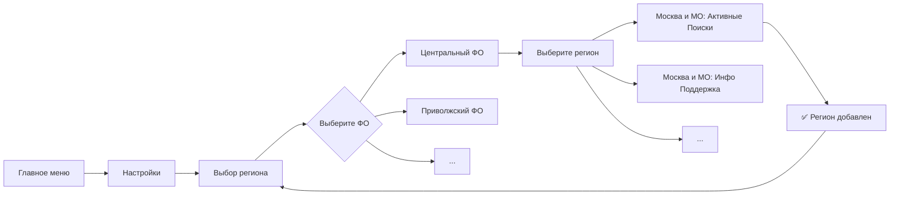
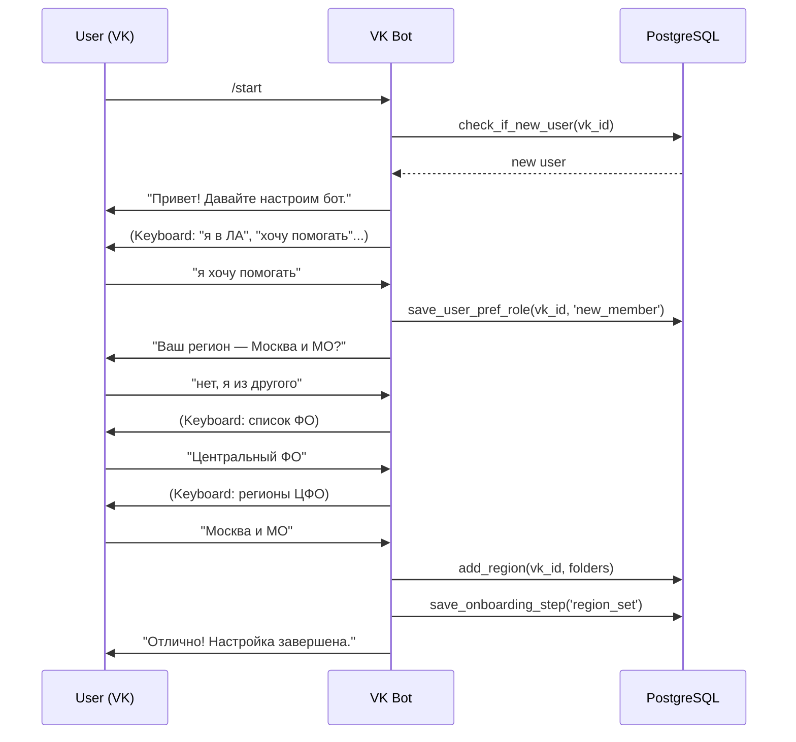
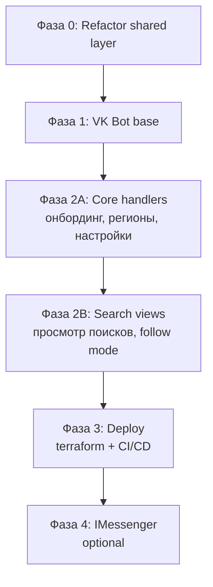
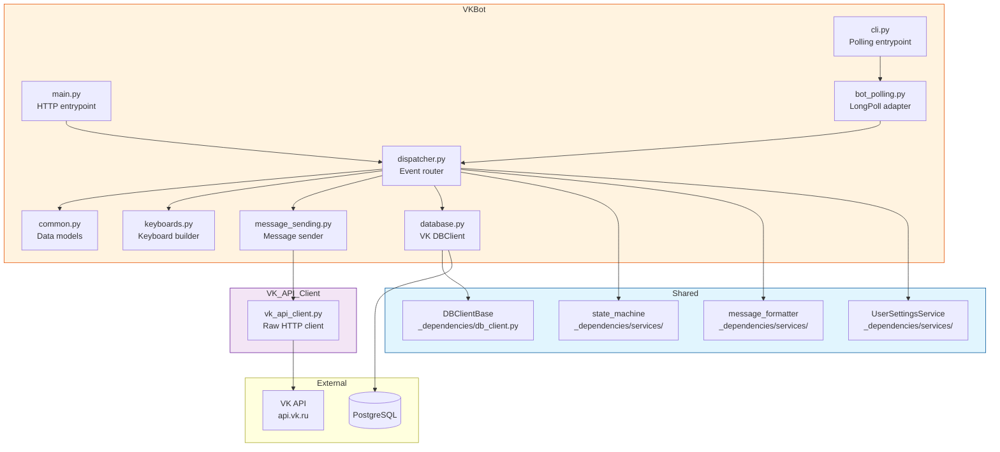

# Архитектура: Дублирование функциональности communicate в VK Bot

## 1. Текущее состояние

### 1.1 Telegram Bot (`src/communicate/`)

```
communicate/main.py
  └── process_update()
       ├── _get_basic_update_parameters()  ← парсинг Update → UpdateBasicParams
       ├── _run_handlers()
       │    └── COMMON_HANDLERS[]          ← цепочка handler'ов
       │         ├── @state_handler         ← проверка UserInputState
       │         ├── @button_handler        ← проверка got_message по списку
       │         └── @callback_handler      ← проверка InlineButtonCallbackData
       └── _process_handler_result()
            ├── _reply_to_user()           ← отправка ответа (InlineKeyboardMarkup / ReplyKeyboardMarkup)
            └── db().set_user_input_state() ← сохранение стейта
```

**Ключевая проблема:** Бизнес-логика (работа с БД, формирование данных) **тесно переплетена** с Telegram-специфичными UI-компонентами (`InlineKeyboardMarkup`, `ReplyKeyboardMarkup`, `CallbackQuery`, `InlineKeyboardButton`, `WebAppInfo`).

### 1.2 VK Bot (`src/vk_bot/`)

```
vk_bot/main.py
  └── main_raw()
       └── UpdateEvent → process_incoming_message()
            ├── Парсинг invite-текста
            └── Вызов vk_api_client.send()
```

**Ограничения:**
- Только привязка аккаунта (Telegram → VK)
- Нет регистрации, настроек, просмотра поисков
- Работает через polling (VkLongPoll)
- [`vk_api_client.py`](src/_dependencies/vk_api_client.py) — минимальный HTTP-клиент (send, get_user_by_login)

### 1.3 Различия VK vs Telegram API

| Характеристика        | Telegram                                                              | VK                                                                |
| --------------------- | --------------------------------------------------------------------- | ----------------------------------------------------------------- |
| **Inline-кнопки**     | `InlineKeyboardMarkup` — callback_data + url                          | `inline_keyboard` — только url-кнопки. Callback-действий нет      |
| **Обычные кнопки**    | `ReplyKeyboardMarkup` — resizeable, request_location, request_contact | `keyboard` — только текст, можно раскрасить. Без request_location |
| **Callback-механизм** | `CallbackQuery` — редактирование сообщения, ответ                     | VK Callback API → событие message_event. Можно editMessage        |
| **Редактирование**    | `editMessageText`, `editMessageReplyMarkup`                           | `messages.edit` — только текст, клавиатуру отдельно               |
| **Геолокация**        | `request_location` в ReplyKeyboard                                    | Нет built-in. Только ручной ввод координат                        |
| **WebApp**            | `WebAppInfo` — Telegram Web Apps                                      | Нет аналога                                                       |
| **Стейт-машина**      | ConversationHandler (не используется) / самописная UserInputState     | Нет встроенной — только самописная                                |
| **Форматирование**    | HTML / MarkdownV2                                                     | Свой формат: **bold**, _italic_, [link\|text], <br>               |
| **Webhook**           | HTTP POST (Yandex Cloud Functions)                                    | Callback API (HTTP POST) или LongPoll                             |

## 2. Предлагаемая архитектура

```
┌──────────────────────────────────────────────────────────────────────┐
│                      Shared Layer (_dependencies/)                    │
│                                                                      │
│  ┌─────────────────────┐  ┌──────────────────┐  ┌────────────────┐  │
│  │ user_settings_      │  │ state_machine.py  │  │ message_        │  │
│  │ service.py          │  │ (UserInputState + │  │ formatter.py   │  │
│  │ (регионы, подписки, │  │  DB-based state)  │  │ (текстовые     │  │
│  │  настройки, роли)   │  │                   │  │  шаблоны)      │  │
│  └─────────────────────┘  └──────────────────┘  └────────────────┘  │
│                                                                      │
│  ┌─────────────────────┐  ┌──────────────────┐  ┌────────────────┐  │
│  │ users_management.py │  │ commons.py        │  │ db_client.py   │  │
│  │ (сущ.)              │  │ (AppConfig,       │  │ (сущ.)         │  │
│  │                     │  │  enums)           │  │                │  │
│  └─────────────────────┘  └──────────────────┘  └────────────────┘  │
└──────────────────────────────────────────────────────────────────────┘
         ▲                            ▲
         │                            │
         ▼                            ▼
┌──────────────────────┐  ┌──────────────────────────┐
│   communicate (TG)    │  │   vk_bot_new (VK)        │
│                       │  │                          │
│  main.py              │  │  main.py                 │
│  handlers/            │  │  handlers/               │
│  buttons.py (TG)      │  │  keyboards.py (VK JSON)  │
│  message_sending.py   │  │  message_sending.py      │
│  regions.py (TG)      │  │  regions.py (VK)         │
│  decorators.py        │  │  dispatcher.py           │
│  common.py            │  │  database.py             │
│  database.py          │  │                          │
└──────────────────────┘  └──────────────────────────┘
```

### 2.1 Shared Layer — новые модули

#### `src/_dependencies/user_settings_service.py`

**Назначение:** Единый API для работы с пользовательскими настройками, используемый обоими ботами.

**Методы:**
- `get_user_settings_summary(user_id) → UserSettingsSummary`
- `save_user_pref_role(user_id, role_desc) → str`
- `save_user_pref_topic_type(user_id, user_role)`
- `save_user_radius(user_id, radius)`
- `delete_user_saved_radius(user_id)`
- `check_saved_radius(user_id) → int | None`
- `save_user_coordinates(user_id, lat, lon)`
- `delete_user_coordinates(user_id)`
- `get_user_coordinates(user_id) → tuple[str,str] | None`
- `toggle_region_subscription(user_id, region_text) → bool`
- `get_user_region_list(user_id) → list[int]`
- `toggle_notification_preference(user_id, pref_name, enable: bool)`
- `get_notification_preferences(user_id) → list[str]`
- `save_age_preference(user_id, age_period)`
- `delete_age_preference(user_id, age_period)`
- `get_age_preferences(user_id) → list[AgePeriod]`
- `save_onboarding_step(user_id, step)`
- `get_onboarding_step(user_id) → tuple[int, str]`
- `register_new_user(user_id, username, timestamp)`
- `check_if_new_user(user_id) → bool`

**Все эти методы уже существуют** в [`communicate/_utils/database.py`](src/communicate/_utils/database.py) и [`_dependencies/users_management.py`](src/_dependencies/users_management.py). Задача: вынести их в shared слой, оставив в communicate тонкую обёртку.

#### `src/_dependencies/state_machine.py`

**Назначение:** Хранение и проверка состояния диалога с пользователем (аналог `ConversationHandler`, но DB-based).

```python
# Интерфейс
class DialogState(Enum):
    radius_input = 'radius_input'
    input_of_coords_man = 'input_of_coords_man'
    input_of_forum_username = 'input_of_forum_username'
    region_selection = 'region_selection'
    not_defined = 'not_defined'

def set_user_state(user_id: int, state: DialogState) -> None: ...
def get_user_state(user_id: int) -> DialogState | None: ...
def clear_user_state(user_id: int) -> None: ...
```

**Сейчас это дублируется:** [`communicate/_utils/database.py`](src/communicate/_utils/database.py) (get_user_input_state, set_user_input_state) и [`connect_to_forum/main.py`](src/connect_to_forum/main.py) (аналогичный TODO).

#### `src/_dependencies/message_formatter.py`

**Назначение:** Все текстовые шаблоны, которые не зависят от платформы. Вынести **тексты** из handler'ов в отдельные константы/функции.

**Пример:**
```python
# Было: текст живёт внутри handler'а
def handle_radius_value(...) -> HandlerResult:
    bot_message = f'Сохранили! ... {saved_radius} км ...'
    
# Стало: текст в shared модуле
def compose_radius_saved_message(saved_radius: int) -> str:
    return f'Сохранили! ... {saved_radius} км ...'
```

### 2.2 VK Bot — новые модули

#### `src/vk_bot/_utils/dispatcher.py`

**Назначение:** Роутер входящих сообщений VK. Аналог `main.py` из communicate + `COMMON_HANDLERS` цепочка.

```python
def dispatch_event(event: UpdateEvent) -> None:
    """Главный роутер VK-бота"""
    event_type = event.type  # message_new, message_event, message_edit...
    
    if event_type == 'message_new':
        handle_message(event.object.message)
    elif event_type == 'message_event':
        handle_callback(event.object)
```

**Детектор команд:**
```python
COMMANDS = {
    '/start': handle_start,
    '/settings': handle_settings,
    '/help': handle_help,
    '/view_searches': handle_view_searches,
}

HANDLER_CHAIN = [
    state_handlers.handle_radius_value,        # state-based
    state_handlers.handle_coords_manual_input, # state-based
    button_handlers.handle_start,              # button/command-based
    button_handlers.handle_settings,
    ...
    button_handlers.handle_unknown,            # fallback
]
```

#### `src/vk_bot/_utils/keyboards.py`

**Назначение:** Построитель VK-клавиатур (JSON-формат).

```python
class VKKeyboard:
    @staticmethod
    def one_column(buttons: list[str]) -> dict:
        """VK keyboard with buttons in one column"""
        return {
            'buttons': [[{'action': {'type': 'text', 'label': btn, 'payload': ''}}] for btn in buttons],
            'one_time': False,
        }
    
    @staticmethod
    def main_menu() -> dict: ...
    
    @staticmethod
    def inline_keyboard(buttons: list[dict]) -> dict:
        """For callback/url buttons (VK inline keyboard in message)"""
        ...
```

#### `src/vk_bot/_utils/message_sending.py`

**Назначение:** Обёртка над VK API для отправки сообщений, обработки ошибок, rate limiting.

```python
class VKMessageSender:
    def send_message(self, user_id: int, text: str, keyboard: dict | None = None) -> None: ...
    def edit_message(self, user_id: int, message_id: int, text: str) -> None: ...
    def send_callback_answer(self, user_id: int, event_id: str, text: str) -> None: ...
```

#### `src/vk_bot/_utils/database.py`

**Назначение:** DBClient для VK-бота. Наследует [`DBClientBase`](src/_dependencies/db_client.py) + использует shared `user_settings_service`.

```python
class DBClient(DBClientBase):
    def set_user_vk_id(self, telegram_user_id: int, vk_id: int) -> None: ...
    # Возможно, понадобится:
    def get_user_by_vk_id(self, vk_id: int) -> int | None: ...  # telegram_user_id
    def is_user_registered_in_vk(self, vk_id: int) -> bool: ...
```

### 2.3 Архитектура handlers для VK

Каждый handler — функция, возвращающая `VKHandlerResult`:

```python
@dataclass
class VKHandlerResult:
    text: str
    keyboard: dict | None = None
    new_state: DialogState | None = None
    edit_message_id: int | None = None  # если нужно отредактировать
```

Пример handler'а:

```python
def handle_radius_value(message: VKMessage, state: DialogState | None) -> VKHandlerResult | None:
    if state != DialogState.radius_input:
        return None
    
    number = _parse_radius(message.text)
    if not number:
        return VKHandlerResult(
            text='Не могу разобрать цифры. Давайте еще раз попробуем?',
            keyboard=VKKeyboard.one_column(['включить ограничение по расстоянию', ...]),
        )
    
    user_settings_service.save_user_radius(message.from_id, number)
    return VKHandlerResult(
        text=f'Сохранили! Теперь поиски, у которых расстояние до штаба превышает {number} км...',
        keyboard=VKKeyboard.one_column([...]),
        new_state=DialogState.not_defined,
    )
```

### 2.4 Регионы: VK vs Telegram

**Проблема:** В Telegram регионы выбираются через `InlineKeyboardMarkup` с буквами-фильтрами (см. [`regions.py`](src/communicate/_utils/regions.py) — `get_inline_keyboard_by_first_letter`).

**Решение для VK:**
- VK не поддерживает callback-кнопки с изменением клавиатуры в том же сообщении
- **Вариант A:** Разбить на иерархию сообщений: "Выберите ФО" → "Выберите регион" → подтверждение
- **Вариант B:** Использовать клавиатуру с 3-4 рядами, пагинация по первой букве (как в Telegram, но каждое нажатие — новое сообщение)
- **Рекомендация:** Вариант A — проще и понятнее пользователю



**Модуль `regions.py`** нужно продублировать (или адаптировать) для VK, убрав зависимость от Telegram-классов. Текущий [`regions.py`](src/communicate/_utils/regions.py) можно отрефакторить, выделив чистые данные (иерархия ФО → регионы) в shared слой:

```python
# src/_dependencies/geo_regions_data.py — чистые данные, без Telegram-зависимостей
class FederalDistrict:
    name: str
    provinces: tuple[tuple[str, tuple[int, ...]], ...]

class GeoData:
    fed_okrugs: tuple[FederalDistrict, ...]
    def get_regions_by_district(district_name) -> list[str]: ...
    def get_folder_ids_by_region(region_name) -> tuple[int, ...]: ...
    def get_all_region_names() -> list[str]: ...
```

### 2.5 Сценарий: новый пользователь в VK

Сейчас пользователь может существовать только если у него есть `vk_id` в таблице `users`, но регистрация идёт через Telegram. Нужна поддержка **создания пользователя прямо из VK**.



**Важно:** Для пользователя, созданного в VK, `telegram_id` будет `NULL`, а `vk_id` — заполнен. Нужно проверить, что все SQL-запросы в shared слое корректно обрабатывают этот кейс. В частности, поле `user_id` в таблице `users` — это `telegram_id`. Нужно либо:
- **Вариант A:** Использовать `vk_id` как `user_id` для VK-пользователей (но это сломает связи, т.к. `user_id` ожидается как Telegram ID)
- **Вариант B:** Создавать синтетический `user_id` для VK-пользователей (отрицательные числа, или префикс)
- **Рекомендация:** **Вариант B** — завести `user_id` как `-vk_id` (отрицательное), чтобы не пересекалось с Telegram ID. Либо добавить поле `messenger_type` ('telegram' | 'vk') и хранить `messenger_user_id`.

**Лучшее решение:** Доработать таблицу `users`:

```sql
-- Текущая схема:
-- users (user_id INT PK, username_telegram, vk_id, ...)
-- user_id = telegram_id

-- Новая схема:
-- users (user_id BIGSERIAL PK, messenger_type TEXT, messenger_user_id TEXT, ...)
-- messenger_type = 'telegram' | 'vk'
-- messenger_user_id = telegram_id or vk_id
```

Но это слишком инвазивно. **Более прагматично:** Генерировать `user_id` для VK-пользователей как `-vk_id`. Тогда:
- Telegram users: `user_id` = `123456789` (положительное)
- VK users: `user_id` = `-123456789` (отрицательное)

Все таблицы используют `user_id INT`, так что это будет работать без миграции схемы.

### 2.6 Фаза 4 (опционально): IMessenger

```python
class Messenger(ABC):
    @abstractmethod
    def send_message(self, user_id: int, text: str, keyboard: Any | None = None) -> None: ...
    @abstractmethod
    def edit_message(self, user_id: int, message_id: int, text: str, keyboard: Any | None = None) -> None: ...
    @abstractmethod
    def send_callback_answer(self, user_id: int, callback_id: str, text: str) -> None: ...
    @abstractmethod
    def build_keyboard(self, buttons: list) -> Any: ...

class TelegramMessenger(Messenger): ...
class VKMessenger(Messenger): ...
```

Это позволило бы **переиспользовать handler'ы** между Telegram и VK, но требует глубокого рефакторинга communicate. **Рекомендуется отложить** на потом, когда оба бота будут стабильно работать.

## 3. Границы ответственности

### Что НЕ делаем (чтобы не сломать существующую систему):

1. **Не меняем схему БД** — работаем в рамках существующей структуры
2. **Не рефакторим communicate** кардинально — только выносим shared логику
3. **Не добавляем новые типы уведомлений** — только воспроизводим существующие
4. **Не трогаем pipeline уведомлений** (`compose_notifications`, `send_notifications`) — они уже умеют отправлять и в VK

### Что делаем:

1. **Выносим бизнес-логику** из communicate в `_dependencies/`
2. **Пишем VK-бот** как отдельную Cloud Function с общим доступом к БД
3. **Добавляем VK-специфичные UI** (клавиатуры, форматирование)
4. **Обеспечиваем создание пользователей** прямо из VK (без Telegram)
5. **Оставляем оба режима** работы VK-бота (polling для разработки, Callback API для продакшена)

## 4. Риски и сложности

| Риск                                   | Описание                                                                                                  | Mitigation                                                                                                                         |
| -------------------------------------- | --------------------------------------------------------------------------------------------------------- | ---------------------------------------------------------------------------------------------------------------------------------- |
| **VK Callback API vs Polling**         | Polling не подходит для serverless. Callback API требует публичного HTTPS-эндпоинта                       | Оставить оба режима: polling для локальной разработки, Cloud Function + terraform для прода                                        |
| **VK Rate Limits**                     | VK имеет суточные лимиты на отправку сообщений сообществом                                                | Внедрить rate limiter в VKMessageSender. Информировать пользователя о лимитах                                                      |
| **Дублирование пользователей**         | Один человек может создать аккаунт и в TG, и в VK, не зная, что они связываются                           | Сохранять `vk_id` в той же строке `users`. При создании VK-юзера — проверять email/phone? Сейчас VK даёт доступ к phone            |
| **Стейт-машина в разных мессенджерах** | Пользователь начал диалог в TG, переключился в VK — state может быть разный                               | `user_id` разный (положительный vs отрицательный) — состояния не пересекаются                                                      |
| **Отсутствие Inline-кнопок в VK**      | Невозможно сделать полноценный аналог `manage_search_whiteness` (переключение отметок в том же сообщении) | Использовать `message_event` (VK Callback API Events) + `messages.edit`. Но это сложнее. Как fallback — отправлять новое сообщение |
| **Координаты**                         | VK не поддерживает `request_location` (нет кнопки "отправить геолокацию")                                 | Только ручной ввод координат для VK. Адаптировать текст подсказки                                                                  |

## 5. Порядок реализации



### Фаза 0 — Рефакторинг shared-слоя

**Задачи:**
1. Создать [`src/_dependencies/user_settings_service.py`](src/_dependencies/user_settings_service.py) — вынести методы работы с настройками из `communicate/_utils/database.py`
2. Создать [`src/_dependencies/state_machine.py`](src/_dependencies/state_machine.py) — вынести `UserInputState` и методы работы с ним
3. Создать [`src/_dependencies/geo_regions_data.py`](src/_dependencies/geo_regions_data.py) — вынести данные регионов (сейчас в `communicate/_utils/regions.py`)
4. Вынести текстовые константы (шаблоны сообщений) — опционально, можно отложить
5. Написать тесты

**Критерий готовности:** `communicate` продолжает работать без изменений. VK-бот может использовать новые shared-модули.

### Фаза 1 — VK Bot: базовая инфраструктура

**Задачи:** Создать модули-«кирпичики», на которых будут строиться handler'ы VK-бота. Аналог существующих `communicate/_utils/buttons.py`, `decorators.py`, `message_sending.py`, `database.py`, `common.py`.

**Полный список создаваемых/изменяемых файлов:**

| Файл                                                                           | Действие | Назначение                                                                |
| ------------------------------------------------------------------------------ | -------- | ------------------------------------------------------------------------- |
| [`src/vk_bot/_utils/keyboards.py`](src/vk_bot/_utils/keyboards.py)             | CREATE   | VK Keyboard Builder (JSON-формат)                                         |
| [`src/vk_bot/_utils/dispatcher.py`](src/vk_bot/_utils/dispatcher.py)           | CREATE   | Роутер событий и handler chain                                            |
| [`src/vk_bot/_utils/message_sending.py`](src/vk_bot/_utils/message_sending.py) | CREATE   | Обёртка отправки сообщений через VK API                                   |
| [`src/vk_bot/_utils/database.py`](src/vk_bot/_utils/database.py)               | CREATE   | VK-специфичный DBClient                                                   |
| [`src/vk_bot/_utils/common.py`](src/vk_bot/_utils/common.py)                   | CREATE   | Data-модели, константы, VKHandlerResult                                   |
| [`src/_dependencies/vk_api_client.py`](src/_dependencies/vk_api_client.py)     | MODIFY   | Добавить `edit_message`, `send_message_event_answer`, включить `keyboard` |
| [`src/vk_bot/_utils/bot_polling.py`](src/vk_bot/_utils/bot_polling.py)         | MODIFY   | Переключить на новый dispatcher                                           |
| [`src/vk_bot/main.py`](src/vk_bot/main.py)                                     | MODIFY   | Интегрировать dispatcher в Callback API entrypoint                        |
| [`src/vk_bot/cli.py`](src/vk_bot/cli.py)                                       | MODIFY   | Обновить CLI entrypoint для нового dispatcher                             |

---

#### 1.1 [`src/vk_bot/_utils/common.py`](src/vk_bot/_utils/common.py) — Data-модели

**Назначение:** Pydantic-модели и dataclass'ы, используемые dispatcher'ом и handler'ами. Аналог [`communicate/_utils/common.py`](src/communicate/_utils/common.py), но без Telegram-зависимостей.

```python
from dataclasses import dataclass, field
from pydantic import BaseModel
from _dependencies.services.state_machine import DialogState


class VKMessage(BaseModel):
    """Парс-результат входящего события VK"""
    text: str                     # тело сообщения
    user_id: int                  # VK user_id (from_id)
    peer_id: int                  # peer_id (чат/диалог)
    message_id: int | None = None # id сообщения (нужен для edit)
    payload: str | None = None    # payload из callback-кнопки (message_event)
    event_id: str | None = None   # event_id для message_event ответа


@dataclass
class VKHandlerResult:
    """Результат работы handler'а — что отправить пользователю"""
    text: str                                              # текст ответа
    keyboard: dict | None = None                           # VK JSON keyboard
    new_state: DialogState | None = None                   # новый стейт диалога
    edit_message_id: int | None = None                     # если нужно отредактировать существующее сообщение
    attachment: str | None = None                          # attachment (photo, doc) — опционально


# Константы (аналог communicate/_utils/common.py)
SEARCH_URL_PREFIX = 'https://lizaalert.org/forum/viewtopic.php?t='
FORUM_FOLDER_PREFIX = 'https://lizaalert.org/forum/viewforum.php?f='
```

**Особенности VK vs TG:**
- Нет `InlineButtonCallbackData` — в VK нет callback_data в inline-кнопках
- Нет `got_callback`/`callback_query` — событие `message_event` обрабатывается отдельно
- Вместо `UserInputState` (enum из communicate) используем [`DialogState`](src/_dependencies/services/state_machine.py:7) из shared-слоя

---

#### 1.2 [`src/vk_bot/_utils/keyboards.py`](src/vk_bot/_utils/keyboards.py) — VK Keyboard Builder

**Назначение:** Построитель VK-клавиатур в JSON-формате. Все кнопки — текстовые (VK поддерживает `primary`, `secondary`, `positive`, `negative` цвета). Inline-клавиатуры — только URL (без callback).

**VK Keyboard JSON format:**
```json
{
  "one_time": false,
  "inline": false,
  "buttons": [
    [
      {
        "action": {
          "type": "text",
          "label": "Button text",
          "payload": "{\"button\": \"1\"}"
        },
        "color": "primary"
      }
    ]
  ]
}
```

**Класс `VKKeyboard`:**
```python
import json
from typing import Literal

ButtonColor = Literal['primary', 'secondary', 'positive', 'negative']


class VKKeyboard:
    """Builder for VK keyboard JSON."""

    @staticmethod
    def _text_button(label: str, color: ButtonColor = 'secondary', payload: str = '') -> dict:
        return {
            'action': {
                'type': 'text',
                'label': label,
                'payload': payload or json.dumps({'button': label}),
            },
            'color': color,
        }

    @staticmethod
    def _url_button(label: str, url: str) -> dict:
        return {
            'action': {
                'type': 'open_link',
                'label': label,
                'link': url,
            },
        }

    @classmethod
    def one_column(cls, buttons: list[str], color: ButtonColor = 'secondary') -> dict:
        """Каждая кнопка — в отдельном ряду (вертикальный список)."""
        return {
            'one_time': False,
            'inline': False,
            'buttons': [[cls._text_button(btn, color)] for btn in buttons],
        }

    @classmethod
    def two_columns(cls, buttons: list[str], color: ButtonColor = 'secondary') -> dict:
        """Кнопки парами в рядах. Если нечётное — последняя одна."""
        rows: list[list[dict]] = []
        for i in range(0, len(buttons), 2):
            row = [cls._text_button(buttons[i], color)]
            if i + 1 < len(buttons):
                row.append(cls._text_button(buttons[i + 1], color))
            rows.append(row)
        return {'one_time': False, 'inline': False, 'buttons': rows}

    @classmethod
    def one_row(cls, buttons: list[str], color: ButtonColor = 'secondary') -> dict:
        """Все кнопки в одном ряду (до 4-5 кнопок)."""
        return {'one_time': False, 'inline': False, 'buttons': [[cls._text_button(btn, color) for btn in buttons]]}

    @classmethod
    def inline_url(cls, buttons: list[tuple[str, str]]) -> dict:
        """Inline-клавиатура с URL-кнопками. buttons = [(label, url), ...]"""
        return {'inline': True, 'buttons': [[cls._url_button(label, url)] for label, url in buttons]}

    @classmethod
    def empty(cls) -> dict:
        return {'one_time': False, 'inline': False, 'buttons': []}
```

**Preset-методы (клавиатуры для меню):**

```python
class VKKeyboard:
    # ... (методы выше)

    @classmethod
    def main_menu(cls) -> dict:
        """Главное меню."""
        return cls.one_column([
            '🔥Карта Поисков 🔥',
            'посмотреть актуальные поиски',
            'настроить бот',
            'другие возможности',
        ], color='primary')

    @classmethod
    def settings_menu(cls) -> dict:
        """Меню настроек."""
        return cls.one_column([
            'настроить виды уведомлений',
            'настроить "домашние координаты"',
            'настроить максимальный радиус',
            'настроить возрастные группы БВП',
            'настроить вид поисков',
            'связать аккаунты бота и форума',
            'связать аккаунты бота и VKontakte',
            'в начало',
        ])

    @classmethod
    def coords_menu(cls) -> dict:
        return cls.one_column([
            'ввести "домашние координаты" вручную',
            'посмотреть сохраненные "домашние координаты"',
            'удалить "домашние координаты"',
            'в начало',
        ])

    @classmethod
    def role_choice(cls) -> dict:
        """Выбор роли при онбординге."""
        return cls.one_column([
            'я состою в ЛизаАлерт',
            'я хочу помогать ЛизаАлерт',
            'я ищу человека',
            'у меня другая задача',
            'не хочу говорить',
        ], color='primary')

    @classmethod
    def yes_no(cls) -> dict:
        return cls.two_columns(['да, это я', 'нет, это не я'], color='primary')

    @classmethod
    def back_to_start(cls) -> dict:
        return cls.one_column(['в начало'])
```

**Маппинг TG → VK кнопок:**

| TG enum                                                                   | TG кнопки                                        | VK preset-метод                       | Примечание                                                             |
| ------------------------------------------------------------------------- | ------------------------------------------------ | ------------------------------------- | ---------------------------------------------------------------------- |
| [`MainMenu`](src/communicate/_utils/buttons.py:76)                        | b_map, b_view_act_searches, b_settings, b_other  | `main_menu()`                         | —                                                                      |
| [`MainSettingsMenu`](src/communicate/_utils/buttons.py:88)                | 7 пунктов настроек + "в начало"                  | `settings_menu()`                     | —                                                                      |
| [`CoordinateSettingsMenu`](src/communicate/_utils/buttons.py:124)         | man_def, check, del + "в начало"                 | `coords_menu()`                       | Нет `request_location` (VK не поддерживает)                            |
| [`RoleChoice`](src/communicate/_utils/buttons.py:57)                      | 5 ролей                                          | `role_choice()`                       | —                                                                      |
| [`DistanceSettings`](src/communicate/_utils/buttons.py:65)                | включить/отключить/изменить радиус               | Отдельные методы                      | —                                                                      |
| [`OtherOptionsMenu`](src/communicate/_utils/buttons.py:131)               | latest_searches, community, first_search, photos | Отдельные методы                      | —                                                                      |
| [`NotificationSettingsMenu`](src/communicate/_utils/buttons.py:99)        | 11 enable + 11 disable кнопок                    | Отдельные методы с `two_columns()`    | Слишком много для одного экрана                                        |
| [`TopicTypeInlineKeyboardBuilder`](src/communicate/_utils/buttons.py:138) | InlineKeyboard с toggle-состояниями              | **НЕТ аналога**                       | VK не поддерживает inline-callback. Решение: разбить на шаги сообщений |
| [`IsMoscow`](src/communicate/_utils/buttons.py:39)                        | b_reg_moscow, b_reg_not_moscow                   | `two_columns()`                       | —                                                                      |
| [`ItsMe`](src/communicate/_utils/buttons.py:71)                           | b_yes_its_me, b_no_its_not_me                    | `yes_no()`                            | —                                                                      |
| [`HelpNeeded`](src/communicate/_utils/buttons.py:83)                      | b_help_yes, b_help_no                            | `two_columns(['да, ...', 'нет, ...']) | —                                                                      |

---

#### 1.3 [`src/vk_bot/_utils/dispatcher.py`](src/vk_bot/_utils/dispatcher.py) — Event Router

**Назначение:** Принимает сырое событие от VK Callback API или LongPoll, парсит его, прогоняет через цепочку handler'ов и отправляет ответ. Аналог [`communicate/main.py:process_update()`](src/communicate/main.py:264) + [`_run_handlers()`](src/communicate/main.py:362) + [`_process_handler_result()`](src/communicate/main.py:341).

**Архитектура dispatcher'а:**

```
VK Event (HTTP или LongPoll)
    │
    ▼
[dispatch_event(raw_event: dict) -> str]
    │
    ├── Парсинг: UpdateEvent → VKMessage
    │   (извлекаем type, object.message, object.payload)
    │
    ├── Фильтр: отсекаем системные события, подтверждения
    │
    ├── Определяем user_id:
    │   │   - Для VK-пользователя: vk_user_id
    │   │   - Маппинг vk_id → telegram_id (если уже привязан)
    │   │   - Если пользователь новый → регистрируем
    │   │
    ├── Обработка событий по типу:
    │   │
    │   ├── event.type == 'message_new'
    │   │   └── handle_new_message(vk_message)
    │   │         │
    │   │         ├── Получить DialogState
    │   │         ├── Запустить handler chain:
    │   │         │   1. state_handler (если DialogState != not_defined)
    │   │         │   2. command_handler (/start, /help, /settings...)
    │   │         │   3. button_handler (по тексту сообщения)
    │   │         │   4. fallback_handler (неизвестная команда)
    │   │         │
    │   │         └── Полученный VKHandlerResult → send_message()
    │   │
    │   └── event.type == 'message_event'  (VK Callback API Events)
    │       └── handle_callback_event(vk_message)
    │             └── send_message_event_answer()
    │
    └── Вернуть 'ok'
```

**Ключевые компоненты:**

```python
# handler chain — список функций для последовательного вызова
HANDLER_CHAIN: list[HandlerFunc] = [
    # State-based handlers (выполняются если DialogState не not_defined)
    handle_radius_value,
    handle_coords_manual_input,
    # Command handlers
    handle_command_start,
    handle_command_settings,
    handle_command_help,
    handle_command_view_searches,
    # Button handlers (по тексту кнопки)
    handle_main_settings,
    handle_notification_settings,
    handle_coordinates_menu,
    handle_coordinates_delete,
    handle_coordinates_check,
    handle_coordinates_manual_input,
    handle_role_selection,
    handle_region_selection,
    handle_forum_linking,
    handle_vk_linking,
    handle_age_settings,
    handle_topic_type_settings,
    handle_radius_settings,
    handle_other_menu,
    handle_map_button,
    handle_view_searches,
    handle_view_latest_searches,
    handle_community,
    handle_first_search_info,
    handle_photos,
    handle_back_to_start,
    # Fallback
    handle_unknown,
]

HandlerFunc = Callable[[VKMessage, DialogState | None], VKHandlerResult | None]


def handle_new_message(vk_message: VKMessage) -> None:
    """Основной роутер для message_new."""
    user_id = vk_message.user_id
    state = get_user_state(user_id)  # из shared state_machine

    # Регистрация нового пользователя
    if user_settings_service.check_if_new_user(user_id):
        register_new_user(user_id, ...)
        _send_and_log(vk_message.peer_id, ...)
        return

    # Handler chain
    for handler in HANDLER_CHAIN:
        result = handler(vk_message, state)
        if result is None:
            continue

        _process_vk_result(user_id, vk_message.peer_id, result)
        return

    # Fallback
    _send_and_log(vk_message.peer_id, 'не понимаю такой команды', keyboard=main_menu())


def _process_vk_result(user_id: int, peer_id: int, result: VKHandlerResult) -> None:
    """Отправить результат handler'а пользователю."""
    if result.edit_message_id:
        edit_message(peer_id, result.edit_message_id, result.text, result.keyboard)
    else:
        send_message(peer_id, result.text, result.keyboard, result.attachment)

    if result.new_state is not None:
        set_user_state(user_id, result.new_state)
    elif result.text:  # любое новое сообщение сбрасывает state
        clear_user_state(user_id)
```

**Регистрация нового VK-пользователя:**

```python
def _register_vk_user(vk_user_id: int, vk_message: VKMessage) -> bool:
    """Создаёт пользователя в БД, если ещё не существует."""
    if user_settings_service.check_if_new_user(vk_user_id):
        register_new_user(vk_user_id, None, datetime.now())
        # Приветственное сообщение с онбордингом
        return True
    return False
```

> **Важно:** Для VK-пользователей `user_id` = `-vk_user_id` (отрицательное), чтобы не пересекаться с Telegram ID. Это решение — временное, до миграции схемы БД с `messenger_type`. Подробнее в [разделе 2.5](plans/vk_bot_duplication_architecture.md#25-Сценарий-новый-пользователь-в-vk).

---

#### 1.4 [`src/_dependencies/vk_api_client.py`](src/_dependencies/vk_api_client.py) — Расширение VK API клиента

**Текущее состояние:** Только `send()` (без keyboard) и `get_user_id_by_login()`.

**Изменения:**

1. **Включить параметр `keyboard`** в методе `send()` (сейчас закомментирован)
2. **Добавить метод `edit_message()`** — вызов `messages.edit`
3. **Добавить метод `send_message_event_answer()`** — вызов `messages.sendMessageEventAnswer`
4. **Добавить метод `delete_message()`** — вызов `messages.delete`

**Детальная спецификация:**

```python
class VKApi:
    API_VERSION = '5.199'

    def send(
        self,
        user_id: int | str,
        random_id: int,
        message: str = '',
        lat: str = '',
        long: str = '',
        keyboard: dict | None = None,     # ← было str, теперь dict
        attachment: str = '',              # ← добавить
        dont_parse_links: bool = False,    # ← добавить (для сохранения ссылок)
    ) -> dict:
        query = {
            'peer_id': user_id,
            'random_id': random_id,
            'v': self.API_VERSION,
            'message': message,
        }
        payload: dict[str, Any] = {}
        if keyboard:
            payload['keyboard'] = json.dumps(keyboard)  # VK требует строку
        if lat and long:
            query['lat'] = lat
            query['long'] = long
        if attachment:
            payload['attachment'] = attachment
        if dont_parse_links:
            payload['dont_parse_links'] = 1

        url = '/method/messages.send'
        resp = self._session.post(url, json=payload, params=query)
        resp.raise_for_status()
        resp_data = resp.json()
        if 'error' in resp_data:
            _handle_vk_error(resp_data['error'])
        return resp_data

    def edit_message(
        self,
        peer_id: int,
        message_id: int,
        message: str,
        keyboard: dict | None = None,
    ) -> dict:
        """https://dev.vk.com/ru/method/messages.edit"""
        query: dict[str, Any] = {
            'peer_id': peer_id,
            'message_id': message_id,
            'message': message,
            'v': self.API_VERSION,
        }
        payload: dict[str, Any] = {}
        if keyboard:
            payload['keyboard'] = json.dumps(keyboard)

        url = '/method/messages.edit'
        resp = self._session.post(url, json=payload, params=query)
        resp.raise_for_status()
        resp_data = resp.json()
        if 'error' in resp_data:
            _handle_vk_error(resp_data['error'])
        return resp_data

    def delete_message(self, peer_id: int, message_ids: list[int]) -> dict:
        """https://dev.vk.com/ru/method/messages.delete"""
        query = {
            'peer_id': peer_id,
            'message_ids': ','.join(str(mid) for mid in message_ids),
            'delete_for_all': 1,
            'v': self.API_VERSION,
        }
        url = '/method/messages.delete'
        resp = self._session.post(url, params=query)
        resp.raise_for_status()
        resp_data = resp.json()
        if 'error' in resp_data:
            _handle_vk_error(resp_data['error'])
        return resp_data

    def send_message_event_answer(
        self,
        event_id: str,
        user_id: int,
        peer_id: int,
        event_data: dict | None = None,
    ) -> dict:
        """Ответ на событие от inline-кнопки (message_event).
        https://dev.vk.com/ru/method/messages.sendMessageEventAnswer"""
        query = {
            'event_id': event_id,
            'user_id': user_id,
            'peer_id': peer_id,
            'v': self.API_VERSION,
        }
        payload: dict[str, Any] = {}
        if event_data:
            payload['event_data'] = json.dumps(event_data)

        url = '/method/messages.sendMessageEventAnswer'
        resp = self._session.post(url, json=payload, params=query)
        resp.raise_for_status()
        resp_data = resp.json()
        if 'error' in resp_data:
            _handle_vk_error(resp_data['error'])
        return resp_data


def _handle_vk_error(error: dict) -> None:
    """Логирование и обработка VK API ошибок.
    Коды: 901 — can't send, 902 — can't send to user, 914 — flood control, etc."""
    error_code = error.get('error_code')
    error_msg = error.get('error_msg', '')
    logging.error(f'VK API error {error_code}: {error_msg}')
    if error_code in (901, 902, 914):
        logging.warning(f'VK send limit or block: {error_msg}')
    # Не кидаем исключение — VK API ошибки не должны ломать бота
```

**VK API error codes to handle:**

| Code | Description                | Action                                |
| ---- | -------------------------- | ------------------------------------- |
| 1    | Unknown error              | Log, continue                         |
| 100  | One of params missing      | Log, fix code                         |
| 200  | Access denied              | Log (user blocked bot)                |
| 901  | Can't send messages        | Log, skip (user disabled messages)    |
| 902  | Can't send to user first   | Log, skip (user hasn't written first) |
| 914  | Flood control (per minute) | Log, retry with delay                 |
| 917  | Flood control (per day)    | Log, stop sending for this user       |

---

#### 1.5 [`src/vk_bot/_utils/message_sending.py`](src/vk_bot/_utils/message_sending.py) — Message Sender

**Назначение:** Обёртка над [`VKApi`](src/_dependencies/vk_api_client.py:9) для отправки сообщений, с обработкой rate limits, генерацией `random_id`, и трекингом inline-диалогов (аналог [`communicate/_utils/message_sending.py`](src/communicate/_utils/message_sending.py)).

```python
import random
from functools import lru_cache
from _dependencies.vk_api_client import get_default_vk_api_client


@lru_cache
def vk_api() -> 'VKMessageSender':
    return VKMessageSender()


class VKMessageSender:
    def send_message(
        self,
        peer_id: int,
        text: str,
        keyboard: dict | None = None,
        attachment: str = '',
    ) -> int | None:
        """Отправить сообщение. Возвращает message_id или None при ошибке."""
        random_id = random.randint(0, 10_000_000)
        try:
            resp = get_default_vk_api_client().send(
                user_id=peer_id,
                random_id=random_id,
                message=text,
                keyboard=keyboard,
                attachment=attachment,
            )
            return resp.get('response', {}).get('message_id')
        except Exception:
            logging.exception(f'VK send_message failed to {peer_id}')
            return None

    def edit_message(
        self,
        peer_id: int,
        message_id: int,
        text: str,
        keyboard: dict | None = None,
    ) -> bool:
        """Отредактировать сообщение."""
        try:
            get_default_vk_api_client().edit_message(
                peer_id=peer_id,
                message_id=message_id,
                message=text,
                keyboard=keyboard,
            )
            return True
        except Exception:
            logging.exception(f'VK edit_message failed: {peer_id=} {message_id=}')
            return False

    def send_callback_answer(
        self,
        event_id: str,
        user_id: int,
        peer_id: int,
        text: str = '',
    ) -> bool:
        """Ответить на callback от inline-кнопки (показать snackbar)."""
        try:
            get_default_vk_api_client().send_message_event_answer(
                event_id=event_id,
                user_id=user_id,
                peer_id=peer_id,
            )
            return True
        except Exception:
            logging.exception(f'VK send_callback_answer failed')
            return False

    def send_with_keyboard(
        self,
        peer_id: int,
        text: str,
        buttons: list[str],
        color: str = 'secondary',
    ) -> int | None:
        """Упрощённый метод: текст + список кнопок в один столбец."""
        from .keyboards import VKKeyboard
        keyboard = VKKeyboard.one_column(buttons, color=color)
        return self.send_message(peer_id, text, keyboard=keyboard)
```

**Rate limit handling (`VKMessageSender` with retry):**

```python
import time

class VKMessageSender:
    _daily_limit_remaining: int | None = None

    def send_message(self, ...):
        if self._daily_limit_remaining is not None and self._daily_limit_remaining <= 0:
            logging.warning('VK daily message limit reached, skipping')
            return None

        while True:
            try:
                resp = get_default_vk_api_client().send(...)
                return resp.get('response', {}).get('message_id')
            except Exception as e:
                if '914' in str(e):  # flood per-minute
                    time.sleep(1)
                    continue
                if '917' in str(e):  # flood per-day
                    self._daily_limit_remaining = 0
                    return None
                return None
```

---

#### 1.6 [`src/vk_bot/_utils/database.py`](src/vk_bot/_utils/database.py) — VK DBClient

**Назначение:** DBClient для VK-бота. Наследует [`DBClientBase`](src/_dependencies/db_client.py:11) и использует shared [`UserSettingsService`](src/_dependencies/services/user_settings_service.py) для бизнес-логики. Содержит только VK-специфичные методы.

```python
from functools import lru_cache
import sqlalchemy
from _dependencies.db_client import DBClientBase
from _dependencies.services.user_settings_service import get_user_settings_service, UserSettingsService


class DBClient(DBClientBase):
    """VK-specific DB operations. User settings delegated to UserSettingsService."""

    def get_user_by_vk_id(self, vk_id: int) -> int | None:
        """Найти user_id (telegram_id) по vk_id.
        Возвращает None если не найден."""
        with self.connect() as connection:
            stmt = sqlalchemy.text("""
                SELECT user_id FROM users
                WHERE vk_id = :vk_id
                LIMIT 1;
            """)
            result = connection.execute(stmt, vk_id=vk_id)
            row = result.fetchone()
            return row[0] if row else None

    def set_user_vk_id(self, telegram_user_id: int, vk_id: int) -> None:
        """Привязать VK ID к существующему пользователю Telegram."""
        with self.connect() as connection:
            stmt = sqlalchemy.text("""
                UPDATE users
                SET vk_id = :vk_id
                WHERE user_id = :user_id;
            """)
            connection.execute(stmt, user_id=telegram_user_id, vk_id=vk_id)

    def is_user_registered_in_vk(self, vk_id: int) -> bool:
        """Проверить, существует ли пользователь с таким vk_id в системе."""
        return self.get_user_by_vk_id(vk_id) is not None

    def resolve_user_id(self, vk_user_id: int) -> int:
        """Определить system user_id для VK пользователя.
        - Если vk_id уже привязан к telegram_id → возвращаем telegram_id
        - Если нет → возвращаем -vk_user_id (отрицательное)
        """
        telegram_id = self.get_user_by_vk_id(vk_user_id)
        if telegram_id:
            return telegram_id
        return -vk_user_id

    @property
    def settings(self) -> UserSettingsService:
        return get_user_settings_service()


@lru_cache
def db() -> DBClient:
    return DBClient()
```

**Usage pattern в handler'ах:**
```python
def handle_some_setting(vk_message: VKMessage, state: DialogState | None) -> VKHandlerResult | None:
    user_id = db().resolve_user_id(vk_message.user_id)
    # Далее работаем с user_id как обычно
    db().settings.save_user_radius(user_id, 50)
```

---

#### 1.7 Модификация существующих файлов

##### [`src/vk_bot/_utils/bot_polling.py`](src/vk_bot/_utils/bot_polling.py)

**Изменения:**
- `process_incoming_message()` заменяется на вызов `dispatch_event()` из нового [`dispatcher.py`](src/vk_bot/_utils/dispatcher.py)
- `DBClient` остаётся (для `set_user_vk_id`), но может быть удалён в пользу нового [`database.py`](src/vk_bot/_utils/database.py)
- Логика invite-линковки (старая) остаётся как handler в chain'е

```python
def process_incoming_message(event: UpdateEvent) -> None:
    """Entry point from LongPoll. Delegates to new dispatcher."""
    from .dispatcher import dispatch_event
    dispatch_event(event.model_dump())
```

##### [`src/vk_bot/main.py`](src/vk_bot/main.py)

**Изменения:**
- `main_raw()` вызывается при HTTP-запросе от VK Callback API
- Раньше: парсил `confirmation` и вызывал `process_incoming_message()`
- Теперь: вызывает `dispatch_event()` для всех событий

```python
def main_raw(request: dict) -> str:
    # confirmation handshake
    if request.get('type') == 'confirmation' and request.get('group_id') == 237036024:
        return get_app_config().vk_confirmation_code

    from ._utils.dispatcher import dispatch_event
    dispatch_event(request)
    return 'ok'
```

##### [`src/vk_bot/cli.py`](src/vk_bot/cli.py)

**Изменения:**
- Обновить `run_polling()` вызов — убедиться, что новый dispatcher используется

---

#### 1.8 Тесты для Phase 1

##### [`tests/test_vk_bot.py`](tests/test_vk_bot.py) — расширение

**Существующие тесты:** `test_parse_event`, `test_get_invite_from_message`.

**Добавить тесты:**

| Тест                                | Что проверяет                                                  |
| ----------------------------------- | -------------------------------------------------------------- |
| `test_keyboard_one_column`          | VKKeyboard.one_column() → правильный JSON                      |
| `test_keyboard_two_columns`         | VKKeyboard.two_columns() → правильное количество рядов         |
| `test_keyboard_one_row`             | VKKeyboard.one_row() → все кнопки в одном ряду                 |
| `test_keyboard_inline_url`          | VKKeyboard.inline_url() → URL-кнопки с open_link               |
| `test_keyboard_main_menu`           | main_menu() preset → содержит все ожидаемые кнопки             |
| `test_keyboard_empty`               | VKKeyboard.empty() → пустой JSON без кнопок                    |
| `test_vk_api_send_with_keyboard`    | VKApi.send() с keyboard параметром                             |
| `test_vk_api_edit_message`          | VKApi.edit_message() → правильный вызов API                    |
| `test_vk_api_delete_message`        | VKApi.delete_message() → правильный вызов API                  |
| `test_vk_api_send_event_answer`     | VKApi.send_message_event_answer()                              |
| `test_vk_message_sender_send`       | VKMessageSender.send_message() → вызывает VKApi.send()         |
| `test_vk_message_sender_edit`       | VKMessageSender.edit_message() → вызывает VKApi.edit_message() |
| `test_vk_message_sender_callback`   | VKMessageSender.send_callback_answer()                         |
| `test_dispatcher_message_new`       | dispatch_event() с message_new → вызывает handler chain        |
| `test_dispatcher_confirmation`      | dispatch_event() с confirmation → возвращает код               |
| `test_vk_handler_result_dataclass`  | VKHandlerResult dataclass → правильные поля                    |
| `test_vk_message_model`             | VKMessage Pydantic model → парсинг из JSON                     |
| `test_db_client_get_user_by_vk_id`  | DBClient.get_user_by_vk_id()                                   |
| `test_db_client_resolve_user_id`    | DBClient.resolve_user_id() → -vk_id для новых пользователей    |
| `test_db_client_is_user_registered` | DBClient.is_user_registered_in_vk()                            |

**Test fixtures (общие для VK tests):**

```python
# tests/conftest.py или tests/test_vk_bot/conftest.py
@pytest.fixture
def vk_keyboard():
    from src.vk_bot._utils.keyboards import VKKeyboard
    return VKKeyboard

@pytest.fixture
def mock_vk_api():
    with patch('_dependencies.vk_api_client.get_default_vk_api_client') as mock:
        yield mock

@pytest.fixture
def vk_message() -> dict:
    return {
        'type': 'message_new',
        'object': {
            'message': {
                'text': '/start',
                'from_id': 12345,
                'peer_id': 12345,
                'id': 42,
            },
        },
    }
```

---

#### 1.9 Dependency Graph (Phase 1)



---

#### 1.10 Порядок реализации Phase 1 (рекомендуемый)

1. **Сначала:** [`common.py`](src/vk_bot/_utils/common.py) — data-модели (нет зависимостей от других VK-модулей)
2. **Сразу:** [`keyboards.py`](src/vk_bot/_utils/keyboards.py) — тоже без зависимостей
3. **Потом:** [`vk_api_client.py`](src/_dependencies/vk_api_client.py) — расширение (нужно для отправки)
4. **Потом:** [`message_sending.py`](src/vk_bot/_utils/message_sending.py) — зависит от vk_api_client + keyboards
5. **Потом:** [`database.py`](src/vk_bot/_utils/database.py) — зависит от db_client + user_settings_service
6. **Потом:** [`dispatcher.py`](src/vk_bot/_utils/dispatcher.py) — зависит от всего выше
7. **В конце:** модификация `main.py`, `bot_polling.py`, `cli.py` — интеграция

**Критерий готовности Phase 1:**
- VK Keyboard Builder генерирует корректный JSON (проверено тестами)
- VK API клиент умеет отправлять/редактировать/удалять сообщения с клавиатурами
- Message sender корректно обрабатывает ошибки и rate limits
- Dispatcher принимает событие VK, прогоняет через handler chain и отправляет ответ
- DBClient корректно резолвит user_id для VK-пользователей
- Существующий функционал (invite-линковка) не сломан
- Все тесты проходят

### Фаза 2 — VK Bot: handlers

**Приоритет:**
1. **Высокий:** Онбординг (регистрация), выбор регионов, настройки уведомлений — то, без чего пользователь не получает пользу
2. **Средний:** Просмотр активных/последних поисков, настройка координат/радиуса/возраста
3. **Низкий:** topic types, привязка форума, help/feedback

### Фаза 3 — Деплой

**Варианты деплоя VK-бота:**
- **Polling** — простое решение, но не подходит для serverless (Cloud Functions имеют таймаут)
- **Callback API** — VK присылает события HTTP POST на эндпоинт. Нужен публичный URL. Подходит для Cloud Functions

**Рекомендация:** VK Callback API. Сейчас в коде есть и polling, и заглушка для Callback API:

```python
def main_raw(request: dict) -> str:
    # confirmation — handshake
    if request['type'] == 'confirmation' and request['group_id'] == 237036024:
        return get_app_config().vk_confirmation_code
    
    event = UpdateEvent.model_validate(request)
    process_incoming_message(event)
    return 'ok'
```

**Для продакшена:** Убрать polling, доработать обработку `message_event` (callback from inline keyboard), добавить terraform-конфиг для HTTP-триггера.

### Фаза 4 — Абстракция IMessenger (опционально)

После того как оба бота написаны и работают, можно выделить общий интерфейс. Но это трудозатратно и может сломать работающую систему. **Рекомендуется сделать только если появится третий мессенджер.**

## 6. Итоговая оценка трудозатрат

| Фаза                   | Трудозатраты | Риск    |
| ---------------------- | ------------ | ------- |
| Фаза 0: Shared layer   | ⭐⭐⭐          | Низкий  |
| Фаза 1: VK base        | ⭐⭐           | Низкий  |
| Фаза 2A: Core handlers | ⭐⭐⭐⭐         | Средний |
| Фаза 2B: Search views  | ⭐⭐⭐          | Средний |
| Фаза 3: Deploy         | ⭐⭐           | Низкий  |
| Фаза 4: IMessenger     | ⭐⭐⭐⭐⭐        | Высокий |
